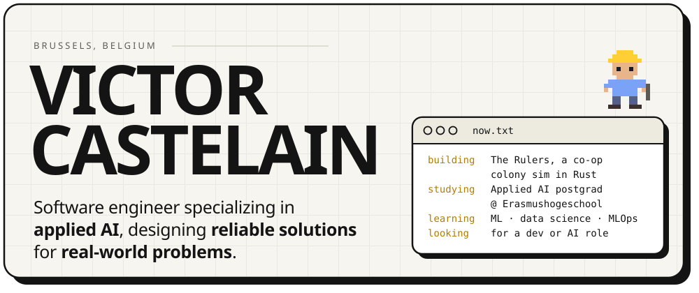
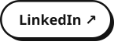

<!-- Banner and buttons are SVGs in assets/ (light + dark), generated to match victorcastelain.com. -->
<a href="https://victorcastelain.com"><picture><source media="(prefers-color-scheme: dark)" srcset="assets/banner-dark.svg"></picture></a>

  <a href="https://victorcastelain.com"><picture><source media="(prefers-color-scheme: dark)" srcset="assets/btn-portfolio-dark.svg"></picture></a>
  <a href="https://victorcastelain.com/cv/Victor-Castelain-CV-EN.pdf"><picture><source media="(prefers-color-scheme: dark)" srcset="assets/btn-resume-dark.svg"></picture></a>
  <a href="https://www.linkedin.com/in/victorcastelain/"><picture><source media="(prefers-color-scheme: dark)" srcset="assets/btn-linkedin-dark.svg"></picture></a>
  <a href="mailto:victor.castelain@hotmail.com"><picture><source media="(prefers-color-scheme: dark)" srcset="assets/btn-email-dark.svg"></picture></a>

<!-- Profile views, counted privately on victorcastelain.com (no data shown here). -->

